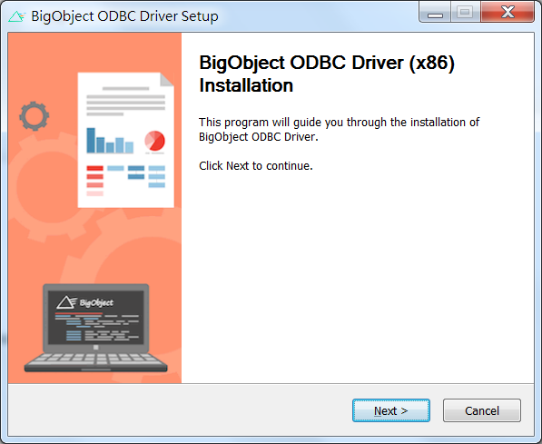
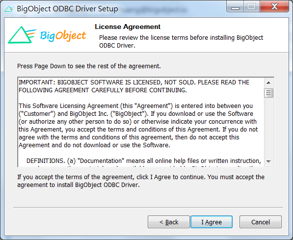
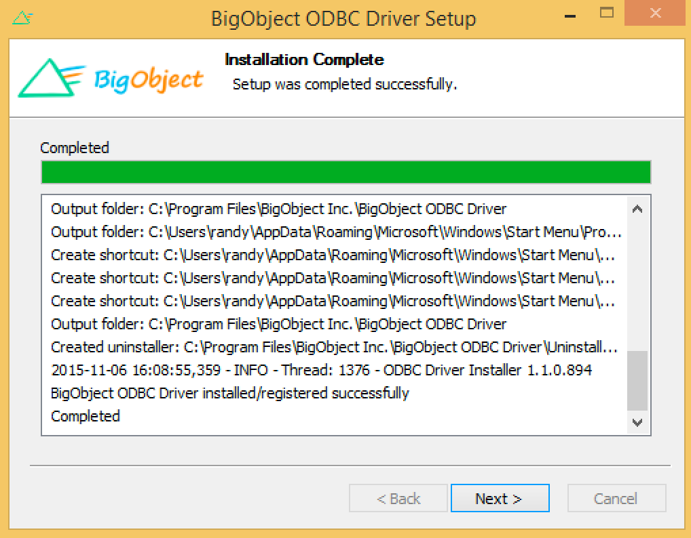
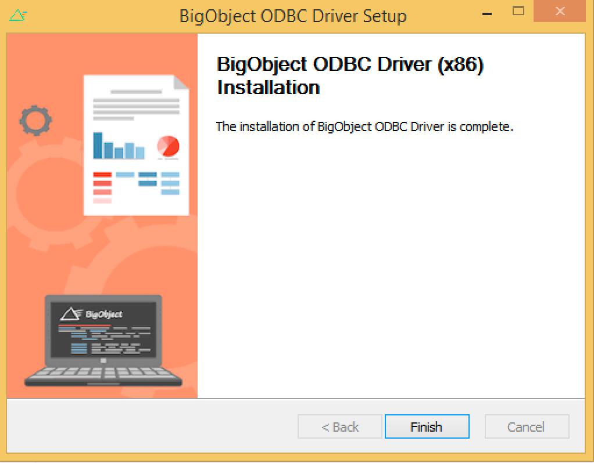

# Installation

####Please download the packages [here](http://sourceforge.net/projects/bigobject-odbc/).

1. Unzip and double-click the "BigObjectODBC-x64"/"BigObjectODBC-x86" according to your Windows version. The first screen of the installer will appear:
 

2. Click Next. The license agreement screen will then appear:
 

3. Read the agreement, and then click “I Agree” button. The installation will proceed:
 

4. Once done, click next and final screen will summarize what have done.  Click Finish on that screen to close the installer:
 
 
5. Ready to Setup New ODBC Data Source.