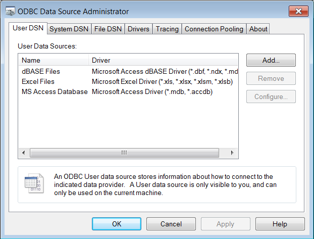
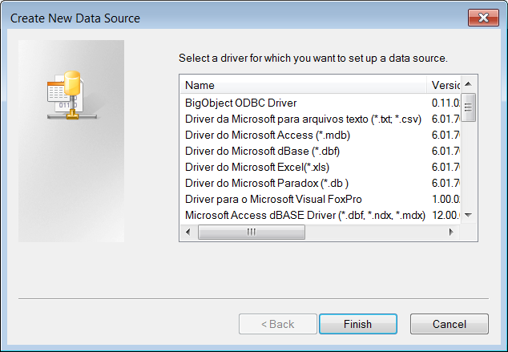
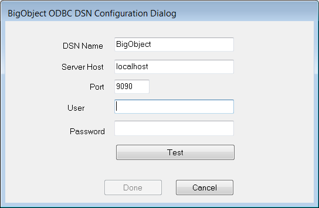
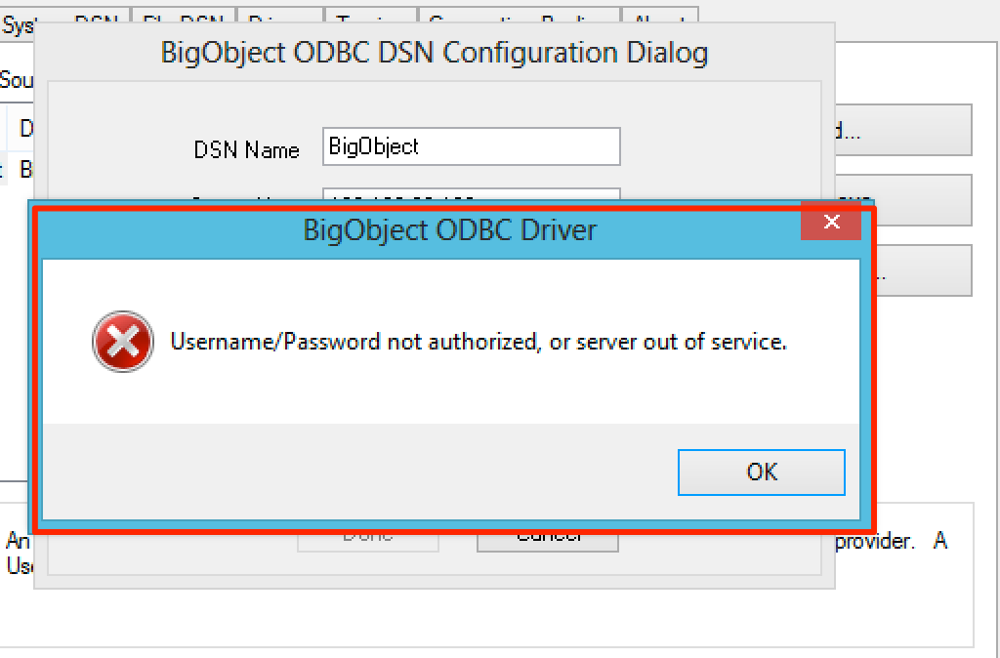
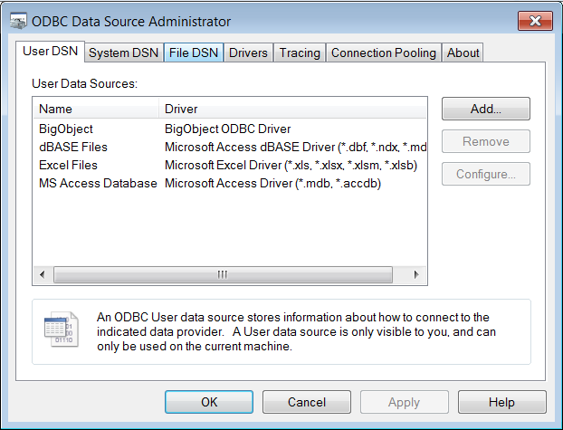

# ODBC Setup

##### This section will walk you through setting up an example BigObject data source that can connect to the BigObject server.

Open up the Data Sources (ODBC) control panel:

*  Click on the Start menu on the desktop.
*  Type ODBC in search bar to search Data Sources (ODBC). 
*  Click (or double-click) on Data Sources (ODBC).

The ODBC Data Source Administrator control panel will appear:
 

1. By default, the control panel opens to the User DSN tab, which lists data sources that are available only to you. If you wish to create the example data source so that it is available to all users on the computer, select the System DSN tab instead.

2. Click the Add button. The Create New Data Source window will appear.

3. Select the BigObject ODBC Driver, as shown above.
4. Click Finish. BigObject ODBC Setup dialog box will then appear:

4. Enter the related information into the fields, following are the demo:

        DSN Name    BigObject-Demo
        ServerHost  192.168.99.100
        Port        9092
6. Click the "Test button" to confirm that everything installed correctly when finished. If you have the wrong settings, the error message will show otherwise it wouldn't pop-up any messages.
 
7. Click OK to close the ODBC Data Source Administrator.
 
