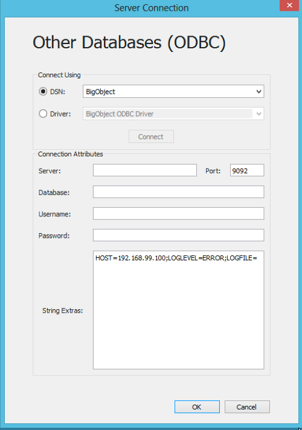
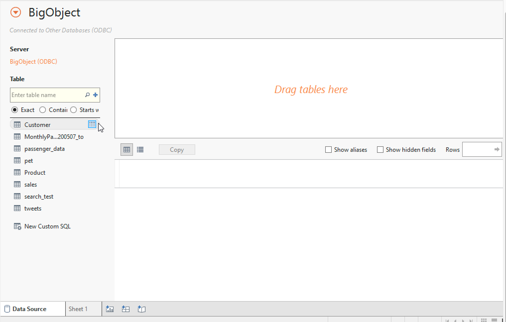
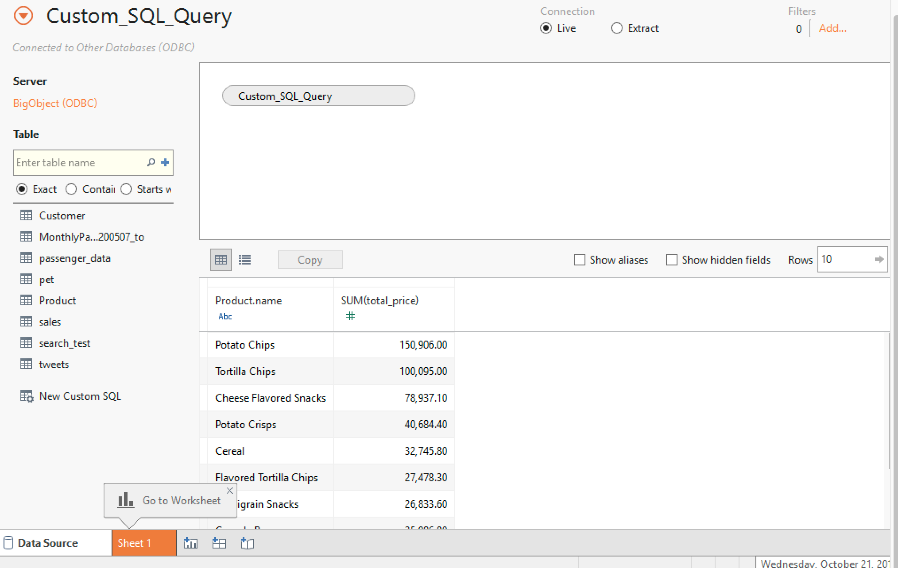

#Play BigObject with Tableau

1. Click "Add New Data Source" -> Choose "Other Databases(ODBC)" and the following "Server Connection" will pup-op. Please choose "BigObject" in DSN drop-down menu as you just setup in previous section.

2. Click "Search" (magnifying glass) button, and you will see tables in left panel.

3. Click "New Custom SQL" and fill up the BigObject SQL related to FIND/SELECT syntax.

4. Here you got the data and could do whatever you want in Tableau.
